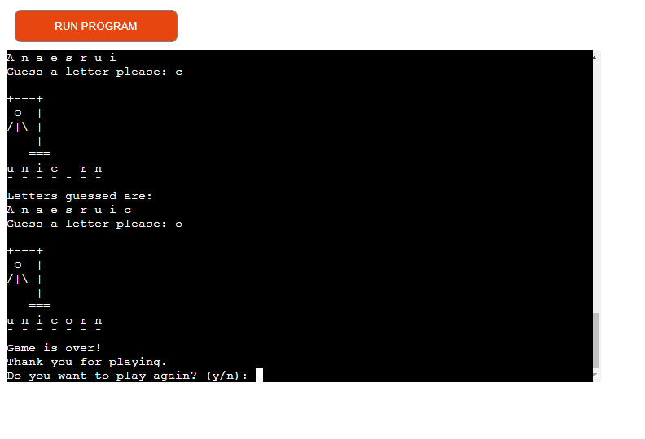
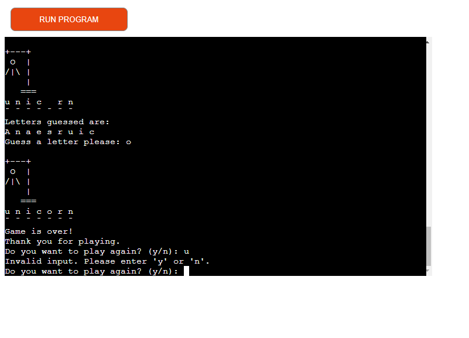
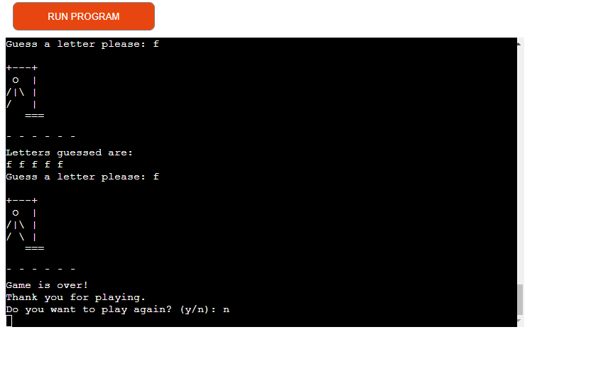
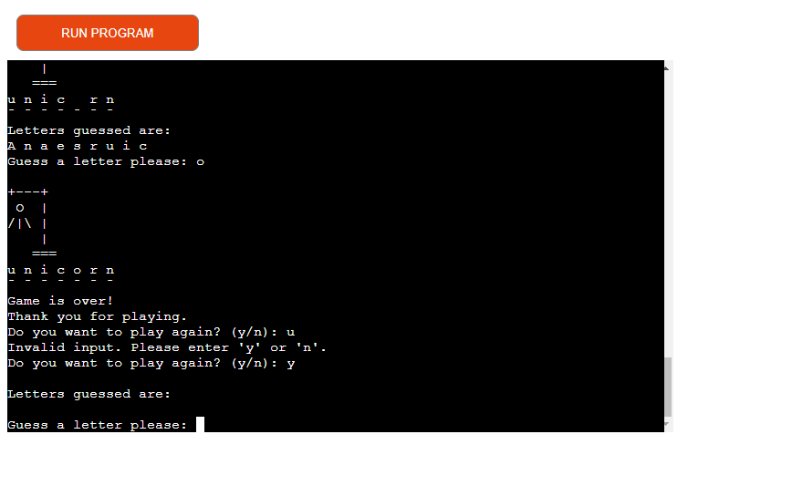
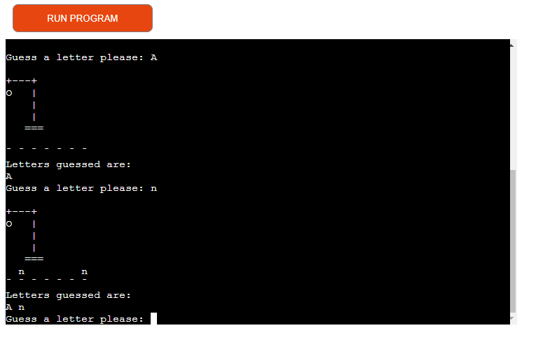
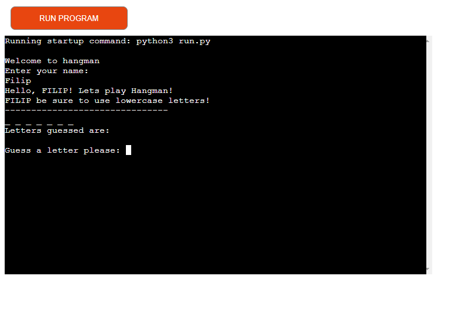
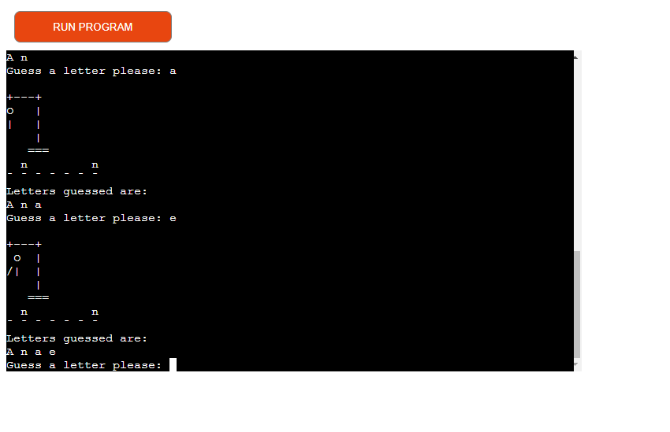
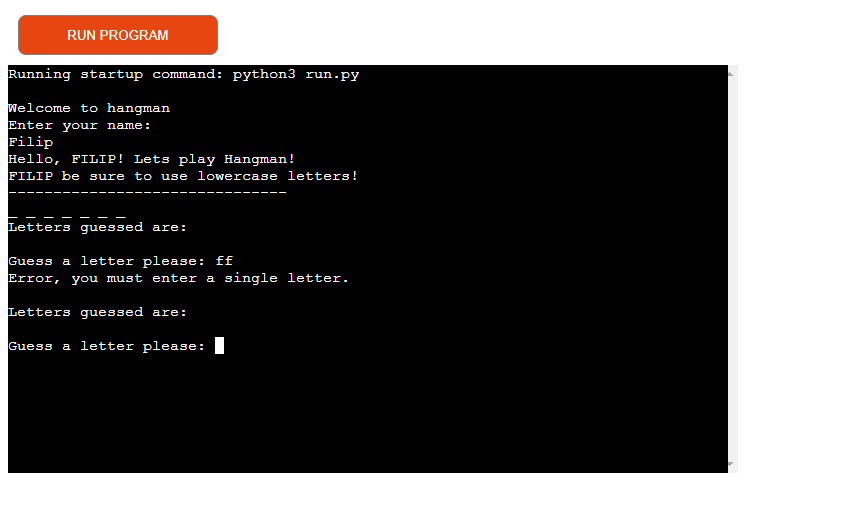
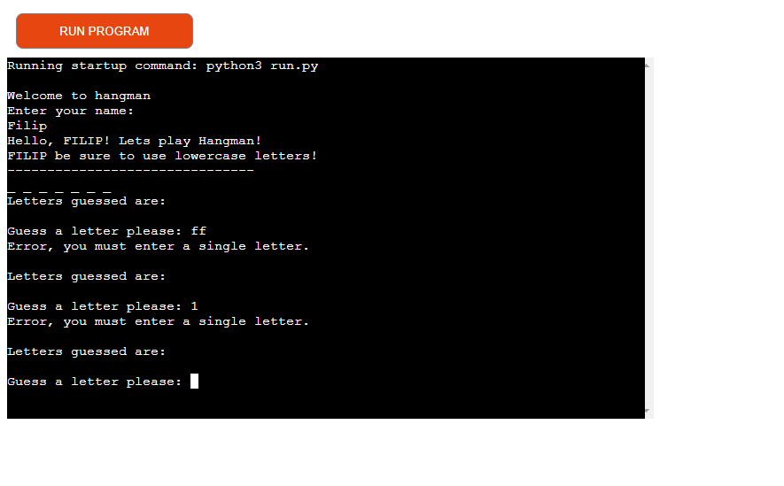
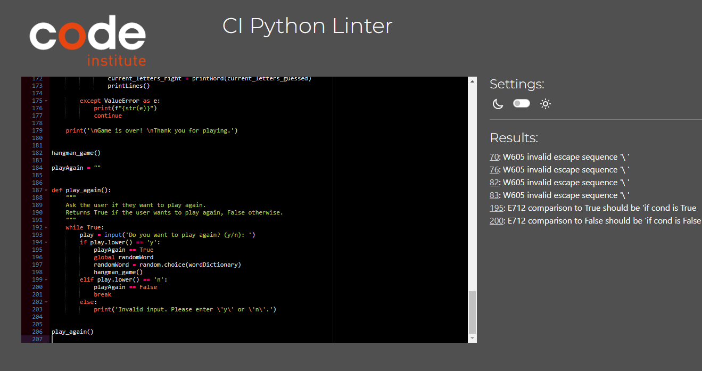

# Hangman game


Hangman is a word-guessing game where one player thinks of a word and the other player tries to guess it by suggesting letters. A gallows and a blank word are displayed, with each incorrect guess resulting in a part of a stick figure being drawn. The guesser wins if they can guess the word before the stick figure is completed; otherwise, the word thinker wins.

[Here is the live version of my project](https://los-hangman.herokuapp.com/)


## How to play

- One player thinks of a word and determines the number of letters in the word.
- The word thinker draws a series of blanks on a piece of paper, with each blank representing a letter in the word.
- The guesser suggests a letter that they think might be in the word.
If the suggested letter is in the word, the word thinker fills in the corresponding blanks with that letter.
- If the suggested letter is not in the word, the word thinker starts drawing the hangman (e.g., the gallows, head, body, arms, legs) one part at a time.
- The guesser continues suggesting letters until they either guess the word correctly or the hangman is completed.
- If the guesser guesses the word correctly before the hangman is completed, they win. Otherwise, the word thinker wins.
- Note: The number of incorrect guesses allowed before completing the hangman is 6.

## Features

- Random word selection: The game randomly selects a word from a predefined list of words.
- Hangman visualization: The code includes a function that displays the hangman figure based on the number of wrong guesses.
- Guessing and checking: The game prompts the player to input a letter, checks if it is correct or wrong, and updates the game state accordingly.
- Displaying guessed letters and word progress: The game shows the letters that have been guessed correctly and their positions in the word, as well as empty spaces for unguessed letters.
- Input validation: The code validates the user's input to ensure it is a single letter.
- Play again function: player can choose if he want play again.
- Error handling: if the player enters something other than letter, he will be warned.

## Future Features

- Difficulty levels: Implement different levels of difficulty, such as easy, medium, and hard, with varying word lengths or limited wrong guesses.
- Category selection: Allow players to choose a specific category for the words (e.g., animals, fruits, countries) or implement multiple word lists for different themes.
- High scores: Add a scoring system to track and display the highest scores achieved by different players.
- Hint system: Introduce a hint feature that provides a clue or reveals a letter in the word to assist the player.
- Multiplayer mode: Enable players to compete against each other by taking turns guessing the word or implement an online multiplayer mode.
- User profiles: Allow players to create profiles, save their progress, and track their game statistics.
- Graphics and animations: Enhance the visual experience with appealing graphics, animations, and sound effects.

## Data Model

### 1. Game:

- Attributes:
    - randomWord: The randomly selected word for the current game.
    - wrongAnswers: The number of wrong answers/guesses made by the player.
    - currentLettersGuessed: A list of letters that the player has guessed.
    - currentLettersRight: The number of correctly guessed letters in the word.
    - lengthOfWordToGuess: The length of the word to guess.

- Methods:

    - printHangman(wrong): Prints the hangman figure based on the number of wrong answers.
    - printWord(guessedLetters): Prints the word to guess with guessed letters filled in and returns the number of correctly guessed letters.
    - printLines(): Prints lines representing unknown letters in the word.
    - hangmanGame(): The main loop for the Hangman game, handles the gameplay logic.

### 2. WordDictionary:

- Attributes:
    - wordList: A list of words that can be selected for the game.
### 3. Player:

- Attributes:
    - name: The name of the player.

### Relationships:
- The Game object has a relationship with the WordDictionary object to access the list of words for word selection.
- The Game object may have a relationship with the Player object if you choose to track player information or implement features like user profiles or high scores.

## Testing
I have manually tested this project by doing the following:
- Passed the code trough a PEP8 linter and confirmed are no problems
- Given invalid inputs: multiple letters when single letter is expected
- Tested in my local terminal and the Heroku terminal
- My family and friends tested the game, this is how we found a bug in the     
  code and then fixed it

- Game over


- Game over - wrong input 


- Not play again


- Play again


- Right guess


- Welcome message


- Wrong guess


- Wrong input


- Wrong input 1



## Validator Testing
- PEP8




## Bugs

- PEP8 validator : line 70, 76, 82, 83 = W605 invalid escape sequence '\ '
- This is Hangman drawing, is not causing any in game erorr 

## Deployment

This project was deployed using Code Institute's mock terminal for Heroku
- Stepd for deployment:
    - Fork or clone this repository
    - Create a new Heroku app
    - Set the buildbacks to Python and NodeJS in that order
    - Link the Heroku app to the repository
    - Click on Deploy

### Forking the GitHub Repository

By forking the GitHub Repository we make a copy of the original repository on our GitHub account to view and/or make changes without affecting the original repository by using the following steps...

1. Log in to GitHub and locate the [GitHub Repository](https://github.com/RockyPraxe/Hangman)
2. At the top of the Repository (not top of page) just above the "Settings" Button on the menu, locate the "Fork" Button.
3. You should now have a copy of the original repository in your GitHub account.

### Making a Local Clone

1. Log in to GitHub and locate the [GitHub Repository](https://github.com/RockyPraxe/Hangman)
2. Under the repository name, click "Clone or download".
3. To clone the repository using HTTPS, under "Clone with HTTPS", copy the link.
4. Open Git Bash
5. Change the current working directory to the location where you want the cloned directory to be made.
6. Type `git clone`, and then paste the URL you copied in Step 3.

```
$ git clone https://github.com/YOUR-USERNAME/YOUR-REPOSITORY
```

7. Press Enter. Your local clone will be created.


## Credits 

- Code Onstitute for the deployment terminal and tutorials , templates...
- [Wikipedia](https://en.wikipedia.org/wiki/Hangman_(game)) for the details of the game
- [W3schools.com](https://www.w3schools.com/css/default.asp) 
- [Youtube link to freecodecamp](https://www.youtube.com/@freecodecamp)
- I used [Am I Responsive](https://ui.dev/amiresponsive) for the responsive design picture for README.md

